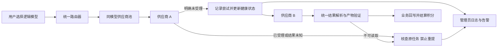
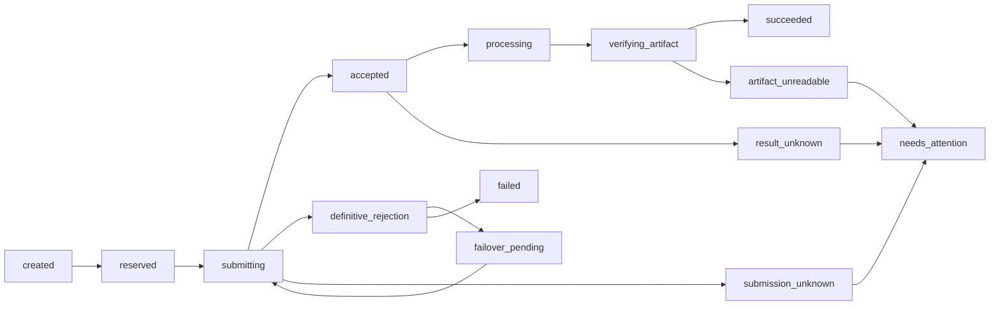
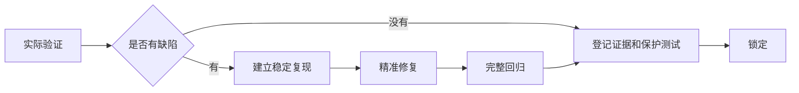

# 平台稳定性、同模型供应商容灾与一次性验收锁定设计

## 状态

- 设计日期：2026-08-15
- 设计状态：用户已确认，进入分阶段实施计划
- 目标分支：`codex/platform-stability-one-pass-lock-20260815`
- 基线：`origin/main@8f9a66cd`
- 本文档只定义设计，不授权付费生成、生产写入、推送、PR、合入或部署。

## 背景

平台近期出现两类反复问题：

1. 图片、视频和文本模型原本已经上线，随后因上游限流、通道下线、返回协议变化、内容误判或结果链接异常而突然不可用。
2. 画布、短剧工厂和剧本分析在持续迭代中容易出现局部功能回归，同一功能被不同会话反复修改和修复。

本设计不假设外部供应商永远稳定。目标是把供应商故障隔离在统一适配层内，并对三个业务板块执行一次性、逐功能的完整验收：没有问题的功能直接锁定；存在问题的功能精准修复、完整验证后锁定。后续开发不得随意改写已锁定行为。

## 目标

1. 用户选择的逻辑模型发生单供应商基础设施故障时，系统自动切换到已经验证的同模型其他供应商，最终把正确且可读取的产物交付用户。
2. 对可能已经被供应商受理的请求禁止自动重复提交，避免重复生成、重复成本和重复扣费。
3. 任务状态、供应商状态、产物状态和积分状态分开记录，任何错误都能追溯到具体请求、配置和路由尝试。
4. 管理员能看到模型与中转站关联、故障日志、自动切换、熔断、成本和对账状态；普通用户不能看到中转站、配置 ID、密钥或内部成本。
5. 对画布、短剧工厂和剧本分析逐项完成真实浏览器、后端状态、素材和积分闭环验证。
6. 每项功能在本轮只经历一次“验证—必要修复—锁定”闭环，后续只允许受控解锁，不反复翻修。
7. 每个实施阶段独立测试、PR 和增量发布，不覆盖其他会话，不影响 AI 音乐服务。

## 非目标

- 不承诺外部供应商永不故障。
- 不自动修改用户提示词、参考图、参考视频或参考音频。
- 不通过切换供应商规避明确且合理的内容安全规则。
- 不把不同能力、不同画质或不同价格的模型伪装成同一模型自动降级。
- 不启用无预算上限的自动付费探测。
- 不因本设计直接修改历史冻结积分、历史未知任务或线上数据库。
- 不整体重写画布、短剧工厂、剧本分析或现有供应商客户端。
- 不触碰、重启或发布 `/opt/moli-mama` AI 音乐项目。

## 核心原则

### 1. 逻辑模型与供应商配置分离

用户选择的是稳定的逻辑模型。一个逻辑模型可以绑定多个供应商配置，但只有满足以下条件的配置才能进入同一自动容灾池：

- 上游实际模型身份一致，或已经通过管理员明确映射为同一逻辑模型。
- 生成类型一致，例如图片、视频或文本不能互相替代。
- 分辨率、时长、比例和参考素材能力满足当前请求。
- 用户价格合同一致；供应商成本可以不同，但只在管理员端记录。
- 使用目标 Key 完成过真实生成，达到成功终态，且产物文件可读取。
- 当前配置已启用、已定价、未熔断且未被管理员暂停。

历史上为了避免串路由而建立的供应商别名不能被模型名相似自动合并。每条加入同模型池的映射都必须由管理员确认并通过能力指纹审计。

### 2. 自动容灾不等于盲目重试

只有能够证明原供应商没有创建任务，或供应商支持可靠幂等键时，系统才能自动切换或重试。

以下情况允许进入同模型备用供应商：

- DNS、TLS 或连接阶段明确失败，且请求体尚未发送。
- 供应商明确返回未受理、通道不可用或限流，并能证明没有创建任务。
- 使用相同幂等键可以由供应商保证不会创建第二个任务。

以下情况禁止自动切换：

- 已获得供应商任务号。
- 请求可能已发送，但连接在响应前中断。
- HTTP 成功但平台无法解析产物。
- 供应商状态未知或轮询超时。

禁止自动切换时，任务进入“提交结果未知”或“生成结果未知”，积分保持冻结，后台产生高优先级核查提醒。

### 3. 成功必须包含可读取产物

供应商返回 `success`、HTTP 2xx 或 `completed` 只是候选成功。平台只有完成以下检查后才能向用户记成功并结算积分：

- 结果字段通过安全协议解析。
- URL、data URL 或允许的 Base64 格式合法。
- 产物能够下载或落盘。
- 文件类型与请求类型一致。
- 图片可解码、视频可读取且基础元数据有效。
- 结果已绑定回业务记录和画布、分镜或分析任务。

成功响应没有可读取产物时进入“产物不可读取”，不得伪装成普通失败，也不得自动再次提交。

## 总体架构

架构分为四层：

1. **能力目录**：维护逻辑模型、供应商配置、能力指纹、用户价格和实际成本关联。
2. **受控路由**：为每次业务请求冻结逻辑模型、参数、价格、候选配置和幂等身份。
3. **统一任务与结果层**：负责提交、轮询、结果解析、产物验证、业务回写和积分结算。
4. **稳定性控制面**：负责健康状态、熔断、自动切换、日志、告警、对账和管理员操作。

## 模型供应商池

### 路由身份

每次请求必须保存：

- 平台业务请求号。
- 幂等键。
- 用户选择的逻辑模型。
- 生成类型和完整能力指纹。
- 用户价格快照。
- 候选供应商配置 ID 有序列表。
- 每次尝试的配置 ID、上游模型、开始时间和结束时间。
- 供应商任务号、HTTP 分类和安全错误摘要。
- 最终成功配置 ID 与实际成本。

普通用户接口只返回逻辑模型和用户可理解的任务状态。供应商、域名、配置 ID、内部错误和成本仅在管理员权限下返回。

### 选择顺序

供应商池按以下顺序选择：

1. 管理员配置的优先级。
2. 当前健康状态。
3. 当前请求能力匹配。
4. 最近熔断和恢复状态。

第一阶段不引入复杂的动态成本竞价或随机权重。优先保证确定性、可解释性和故障可复现。

### 健康状态

每个“供应商配置＋上游模型”维护独立状态：

- `healthy`：允许正常接收任务。
- `degraded`：近期存在基础设施失败，但仍未达到熔断条件。
- `open`：已熔断，新请求跳过。
- `half_open`：冷却后只允许一个正常业务请求试探，试探请求仍受同模型备用路由保护。
- `disabled`：管理员停用或真实生成门禁失效。

内容安全拒绝、用户参数错误和能力不匹配不计入供应商基础设施健康度。默认阈值在实施前结合线上流量确定并写入任务计划；阈值调整必须留审计记录，不能隐藏在代码常量中随意修改。

## 任务与积分状态机

任务状态和积分状态是两个独立合同。

### 任务状态

终态或关注态含义：

- `succeeded`：产物可读取且业务回写完成。
- `failed`：已经证明失败，不存在未知供应商任务。
- `submission_unknown`：可能已经提交，禁止自动重提。
- `result_unknown`：已经受理但无法确认终态。
- `artifact_unreadable`：供应商声称成功但产物不可用。
- `needs_attention`：自动对账无法在规定时间内得出结论。

### 积分状态

- `reserved`：积分已冻结，任务尚未完成。
- `charged`：仅在可读取产物和业务回写均成功后结算。
- `refunded`：仅在明确失败且没有未决供应商任务时退款。
- `held_for_review`：提交、结果或产物状态未知时保持冻结。

任何任务状态转换都必须使用条件更新或同等原子保护，重复回调、页面刷新、队列重放和服务器重启不能造成二次扣款、二次退款或二次提交。

### 对账与恢复

后台对账任务负责：

- 恢复服务器重启后仍处于 `accepted` 或 `processing` 的任务轮询。
- 核对长时间 `reserved` 的积分记录与业务任务。
- 核对供应商任务号、业务结果和产物文件。
- 将可证明失败的任务退款。
- 将无法自动证明的任务提升为管理员待处理事件。

对账不得通过“先退款再重新提交”解决未知任务。

## 管理员日志与告警

### 管理员稳定性日志

每条事件至少包含：

- 时间、严重级别和事件类型。
- 平台业务请求号、租户和脱敏用户标识。
- 逻辑模型、请求能力指纹和用户价格快照。
- 失败配置 ID、供应商域名、上游模型和错误分类。
- 是否已经获得供应商任务号。
- 是否触发自动切换、切换目标和最终结果。
- 任务状态、积分状态和实际成本状态。
- 熔断、半开放和恢复记录。

日志禁止保存 API Key、Authorization、完整 Base64、签名 URL 查询参数或用户提示词全文。需要排查内容时使用受权限控制的业务记录，不把敏感内容复制到通用稳定性日志。

### 告警分级

- **P0**：同模型全部供应商不可用、重复扣费、跨租户数据风险、数据库或存储不可用。
- **P1**：任务队列停止、未知任务持续增长、核心板块不可用、自动切换后仍持续失败。
- **P2**：单供应商连续失败并熔断、部分功能失败或性能明显下降。
- **P3**：偶发且已经自动恢复的问题。

P0/P1 在管理员后台置顶并进入待处理事件列表。如果项目已经存在企业微信告警通道，则复用现有通道；不为本方案重复建设第二套外部通知系统。

## 一次性验证与版本化锁定

### 逐项闭环

本轮审计中的每个功能只能按以下流程处理：

- **无缺陷**：不修改业务代码，登记证据后直接锁定。
- **有缺陷**：先复现，精准修复，完整回归后锁定。
- **已锁定**：后续阶段只做回归，不顺带优化、不重构、不改写交互。
- **回归失败**：修复造成回归的新改动或撤销新改动，不重新设计已锁定行为。

### 锁定清单

实施阶段建立机器可读的功能锁定清单。每项至少记录：

- 稳定功能 ID、板块、入口和验收标准。
- `locked_pass`、`locked_fixed` 或 `blocked` 状态。
- 验证日期、基线提交和生产 release。
- 自动化测试、浏览器证据和后端状态证据位置。
- 涉及的关键合同和受保护文件范围。
- 缺陷编号与修复提交；无缺陷时明确记录“未修改业务代码”。
- 后续修改必须触发的测试集合。

锁定清单进入 CI 和发布审计。触碰受保护范围时必须声明解锁原因并运行对应测试；未声明的修改直接阻断合入或发布。

### 允许解锁的情况

只有以下情况允许解锁：

1. 出现新的、可复现的生产故障。
2. 用户明确批准改变原有需求。
3. 外部供应商协议、浏览器能力或必要依赖发生变化。

解锁必须记录原因、影响范围和批准依据。修复或变更完成后重新执行对应验收并形成新的锁定版本。

## 完整功能验收矩阵

在开始修复前，先从前端路由、页面、按钮、后端接口、管理员配置和线上实际入口生成精确功能总清单。不得只依赖历史文档、已有测试名称或静态页面推断功能完整。

### 画布

至少覆盖：

- 新建、打开、保存、自动保存、刷新恢复和并发写入保护。
- 撤销、重做、缩放、平移、导航、节点拖动和节点缩放。
- 节点编辑框与节点位置/视口同步、完整展示和响应式尺寸。
- 现有全部节点类型、节点工具栏按钮、连线、断线和空白连接创建。
- 图片、视频、音频和文本素材上传、素材库复用和生成历史。
- 参考素材顺序、编号提及、右键引用、首尾帧及多图/多视频/多音频边界。
- 图片、视频和文本模型目录、能力、参数、用户价格、成本和配置路由。
- 提交、轮询、自动同模型供应商切换、产物回写、预览、下载、重试和积分。
- 导演台、摄影机、人物变换、姿势、灯光、时间线、导出以及现有全部可见交互。
- 普通用户不能看到中转站、配置 ID、密钥或内部成本。

### 短剧工厂

至少覆盖：

- 项目、剧集、分镜和当前集上下文。
- 剧本导入、角色、场景、道具和素材资产。
- 分镜编辑、导演信息、模型参数和参考资产。
- 单个生成、批量生成、重新生成、版本替换和任务恢复。
- 图片、视频、音频和文本生成的任务、素材、积分与失败闭环。
- 预览、下载、导出、归档以及刷新后的数据恢复。
- 从剧本分析导入和向画布投影后的身份、顺序、引用和参数一致性。

### 剧本分析

至少覆盖：

- 文本输入、文件导入、模型配置、提交、进度和失败提示。
- 页面刷新和服务器重启后的原任务续跑。
- 重复点击、重复回调和重复导入的幂等保护。
- 分析结果编辑、人物、场景、道具和导演故事板。
- V1/V2 数据兼容、历史结果恢复和资产身份稳定。
- 导入短剧工厂和投影到画布后的完整数据回读。
- 文本模型供应商故障、结果未知、积分状态和管理员日志。

### 公共能力

至少覆盖：

- 登录、权限、管理员 RBAC 和租户隔离。
- 积分预估、冻结、扣除、退款和对账。
- 数据库、队列、对象存储、静态素材和下载链。
- 前端错误提示、服务器重启、页面刷新和并发操作。
- 管理员模型配置、逻辑模型映射、供应商日志和健康状态。
- 生产构建、备份、回滚、增量发布范围和 AI 音乐隔离。

## 验证证据等级

每项功能按适用范围收集以下证据：

1. **合同测试**：参数、能力、价格、成本、状态和权限映射。
2. **后端集成**：真实接口、SQLite、任务、素材和积分状态。
3. **真实浏览器**：逐按钮和逐交互操作；页面存在不等于通过。
4. **完整业务链**：前端提交、服务处理、状态回写、可读取产物、下载和积分。
5. **真实供应商**：每类能力选择一个主模型和一个备用模型，单次付费前单独汇报模型、次数、价格/积分和余额并获得授权。
6. **生产回读**：部署版本、健康、日志、功能入口和 AI 音乐 PID 隔离。

验收状态只允许：`pass`、`fail`、`blocked`、`not_applicable`。阻塞和不适用必须写明原因，不能当作通过。

## 自动巡检与运行保护

### 不付费自动巡检

- 前后端健康、数据库、队列、对象存储和磁盘空间。
- 模型目录、逻辑模型映射、能力、价格和供应商配置一致性。
- 任务幂等、积分状态和对账合同。
- 图片、视频和文本供应商异常的模拟测试。
- 素材上传、读取、下载和过期链接处理。
- 三个板块的无付费浏览器冒烟。
- 管理端可见供应商、普通用户端不暴露的权限回归。

供应商模型列表和只读连接检查只代表连接证据，不代表真实生成可用。

### 付费真实巡检

默认不自动执行。每次真实生成验证必须先完成本地和无付费准备，再汇报：

- 模型和供应商。
- 请求参数和次数。
- 预计用户积分、供应商成本和当前可用余额。
- 是否为首次提交或已存在未知任务。

获得明确的一次提交授权后才能执行。结果未知时禁止自动再次提交。

## 分阶段交付

### 阶段 1：稳定性底座

- 逻辑模型供应商池和能力指纹。
- 受控路由、尝试日志、健康状态和熔断。
- 任务/积分状态机、产物验证和对账。
- 管理员稳定性日志、告警和中转关联。
- 无付费故障模拟、全量测试和发布门禁。

### 阶段 2：画布一次性验收锁定

- 建立完整功能清单。
- 按清单逐项验证。
- 有缺陷则精准修复并回归；无缺陷直接锁定。
- 完成画布锁定清单、证据和独立发布。

### 阶段 3：短剧工厂一次性验收锁定

- 建立完整功能清单。
- 按清单逐项验证。
- 有缺陷则精准修复并回归；无缺陷直接锁定。
- 完成短剧工厂锁定清单、跨板块回读和独立发布。

### 阶段 4：剧本分析一次性验收锁定

- 建立完整功能清单。
- 按清单逐项验证。
- 有缺陷则精准修复并回归；无缺陷直接锁定。
- 完成剧本分析锁定清单、端到端导入/投影回读和独立发布。

每个阶段是独立 PR 和独立生产候选。前一阶段已锁定范围在后一阶段只做回归，不混入新的优化。

## 测试与合入门禁

每个阶段至少通过：

- 针对新增行为的 TDD 测试。
- 后端全量测试。
- 前端全量 Node 测试。
- 前端生产构建。
- 对应板块的 Playwright 浏览器测试。
- 无付费本地完整链路或可控后端集成测试。
- 模型能力、用户价格、内部成本和供应商映射审计。
- 任务、积分、权限、租户和敏感信息回归。
- 增量发布范围审计和受保护合同审计。

一个阶段存在未解决 P0/P1、未知计费风险或生产范围冲突时，不得合入或部署。

## 生产发布保护

1. 实现完成后提交任务分支，推送 PR，等待 CI 通过并合入 `main`。
2. 发布前通过 SSH 重新读取实时 `/opt/moli-drama/current`、`deploy.lock`、活动任务、队列、健康、日志和 AI 音乐 PID。
3. 与其他会话核对生产操作和改动文件范围；存在重叠或发布锁时停止。
4. 候选从当时实时 `current` 克隆，只覆盖本阶段 allowlist 内的文件。
5. 构建前后执行增量范围审计、受保护合同审计、数据库备份和完整性验证。
6. 只使用共享 `activate-protected-release.sh CANDIDATE EXPECTED_CURRENT` 激活。
7. 激活后执行健康、日志、无付费冒烟、版本回读、数据库和 AI 音乐 PID 检查。
8. 异常时按候选 release 整体回滚，不直接在线覆盖文件。

## 设计方案选择

### 选中：先稳定性底座，再逐板块一次性闭环

优点：统一处理上游故障，后续三个板块不重复实现容灾；每个阶段边界清楚，适合独立 PR 和增量发布；已锁定功能不会被后续阶段反复修改。

代价：第一阶段需要先梳理任务、计费和供应商合同，业务界面的可见改进不会最先出现。

### 未选：先审计三个板块，最后统一稳定层

短期能更快列出界面缺陷，但同一种供应商故障会在多个板块重复修复，锁定后还需要再次修改公共链路，不符合一次性闭环目标。

### 未选：三个板块与稳定层一次性大改

文件冲突、回归和生产覆盖风险最高，难以证明每个缺陷由哪项修改解决，也不符合精准修改和独立增量发布要求。

## 成功标准

- 同一逻辑模型存在健康备用供应商时，明确未受理的基础设施故障能够自动切换并交付可读取结果。
- 可能已受理或结果未知的任务不会自动重提，积分保持冻结并进入管理员核查。
- 用户只看到逻辑模型和清晰任务状态；管理员能追溯全部供应商尝试、切换、成本、积分和健康状态。
- 画布、短剧工厂、剧本分析都有完整功能总清单；每项均为通过、阻塞或不适用，并具有本轮证据。
- 本轮发现的缺陷都有复现、精准修复、回归和锁定记录；无缺陷功能没有不必要的业务代码改动。
- 已锁定功能受到测试、锁定清单、CI 和发布审计保护，后续未声明解锁的修改不能合入或部署。
- 每阶段全量测试、生产构建、浏览器验收和发布审计通过，无未解决 P0/P1。
- 每次生产候选基于当时最新线上 release，只包含 allowlist 改动，并通过共享发布门禁。
- 生产切换后功能、积分、日志和版本回读正常，AI 音乐服务及其他会话改动不受影响。

## 当前基线证据

在文档分支建立前已从最新 `origin/main@8f9a66cd` 创建隔离工作树，并完成无付费基线验证：

- 后端：782 项通过，1 项跳过，0 项失败。
- 前端：644 项通过，0 项失败。
- 本阶段未调用真实供应商、未写生产、未推送、未部署。
