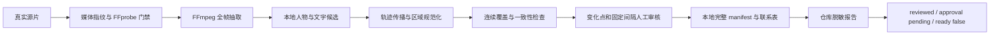

# 整集全帧人物与文字区域审核设计

日期：2026-08-15

状态：设计已通过，待书面规格审查

范围：仅本地开发与验证，不调用供应商，不产生付费任务，不部署

## 1. 背景

当前整集 1:1 复刻案例已经具备以下基础：

- 源片媒体指纹与 9 镜连续时间轴；
- 5 名目标剧情角色及 en-US 本地化姓名；
- 逐镜参考包、身份、文字净景、运动参考和对白门禁；
- `silent/spoken` 与 `speech_required` 声音合同；
- 真实 FFmpeg 本地切镜和代表帧证据。

现有 fixture 仍将 `face_track_review` 和 `text_region_review` 保持为 `pending`。它只记录了抽帧级人物与文字事实，不能证明整集所有源帧中的人物和文字都被完整盘点。

本阶段建立 `redraw-full-frame-coverage-v1` 本地证据合同。它覆盖整段源片的每一帧，输出人物轨迹、文字轨迹、保守审核遮罩、联系表和脱敏报告。最终状态只能到达「已审核、待用户批准」，不能自行开放参考包门禁。

## 2. 已锁定决策

### 2.1 人物范围

审核所有可见人物，而不只审核可辨认人脸。以下情况都必须进入候选与人工复核：

- 正脸、侧脸和背影；
- 被物体或其他人物遮挡的身体；
- 只露出头部、上身、肢体或轮廓的人物；
- 背景群演和短暂闪现人物；
- 镜面、电视或屏幕中仍可辨认为人物的区域。

5 名剧情角色绑定固定目标演员：Mateo、Diego、Lucas、Elena、Rafael。其他人物按 `background_extra` 处理：原人物身份必须去除，后续成片可以按场景需要重生为不具名外国成年群演。

### 2.2 文字范围

审核所有可见文字和文字状区域，包括：

- 烧录硬字幕；
- 电脑、电视和手机画面；
- 招牌、海报、标签和包装；
- 浏览器栏、应用 UI 和系统 UI；
- Logo、水印和角标；
- 低清、模糊或无法可靠读取的文字块。

目标成片策略固定为：

- 原硬字幕清除后，在对应位置重绘英文字幕；
- 剧情关键屏幕文字本地化为英文；
- Logo、水印和无关 UI 清除或泛化；
- 无法分类的文字区域保持 `unknown`，阻断审核通过。

### 2.3 审核强度

自动管线必须处理全部源帧。人工审核不逐一点击每帧，而是审核：

- 每镜首帧和末帧；
- 每 1 秒固定审核点；
- 人物或文字出现、消失的变化点；
- 遮挡状态变化、轨迹切换和遮罩面积突变点；
- 镜头切点前后帧；
- 检测器间结论不一致的帧。

完整帧清单不得有序号、时间戳或覆盖空洞。工具候选永远不能自动批准。

### 2.4 交付深度

本阶段只交付：

- 全帧清单；
- 人物与文字轨迹；
- 逐帧保守审核遮罩；
- 逐镜联系表和离线审核索引；
- 完整本地 manifest；
- 仓库内脱敏证据报告。

本阶段不生成净化视频，不生成目标演员视频，不重绘英文字幕，不写生产数据库，也不调用外部生成模型。

## 3. 架构

采用「确定性全帧管线 + 本地检测辅助 + 人工关键点审核」的混合双通道方案。



### 3.1 确定性层

FFmpeg 与 FFprobe 负责：

- 校验源 SHA-256、时长、尺寸、编码、帧率和音频摘要；
- 按实际帧时间抽取全部帧；
- 为每帧生成连续 `frame_index`、时间戳、宽高和 SHA-256；
- 以 FFprobe 实际读帧数为准，不在代码中硬编码 2,062 帧；
- 验证 9 镜时间窗连续覆盖 `0..68733 ms`。

### 3.2 候选层

候选层使用本地开源模型，只产生建议：

| 能力 | 组件 | 用途 |
|---|---|---|
| 人物检测 | YOLOX | 提供全身、局部身体和背景人物候选框 |
| 轨迹关联 | ByteTrack | 在全部帧中关联人物候选 |
| 人脸交叉检查 | 现有 MediaPipe face detection | 补充可辨认人脸和剧情角色映射证据 |
| 文字区域检测 | PaddleOCR text detection | 只输出文字多边形，不运行或保存 OCR 识别原文 |

YOLOX 和 PaddleOCR 代码采用 Apache-2.0，ByteTrack 代码采用 MIT。模型权重必须单独核对来源和许可证，不能仅根据代码仓库许可证推断权重许可。

候选层不得把「没有检测结果」解释为「画面没有人物或文字」。模型缺失、加载失败、输出格式漂移或权重哈希不匹配时，整个审核任务失败。

### 3.3 人工审核层

人工审核负责：

- 分类人物为 `story_role` 或 `background_extra`；
- 将剧情角色绑定到固定角色 ID；
- 确认人物可见状态和轨迹连续性；
- 分类全部文字区域并分配目标处置；
- 修正漏检、误检、遮挡和轨迹跳变；
- 记录候选值、最终值、修正原因和 reviewer。

人工审核完成后只写 `reviewed=true`。用户明确批准前，`approval_status` 必须保持 `pending`。

## 4. 本地模型获取与锁定

用户已允许在设计批准后下载并固定开源本地模型。下载行为不包含源片上传，也不授权任何供应商调用。

### 4.1 模型锁文件

模型获取器必须生成本地 `model-lock.json`，每个组件包含：

```json
{
  "component": "person_detector",
  "project": "YOLOX",
  "source_url": "https://github.com/Megvii-BaseDetection/YOLOX",
  "revision": "an-exact-tag-or-commit",
  "artifact_name": "an-exact-weight-file",
  "artifact_url": "an-official-artifact-url",
  "artifact_sha256": "64-lowercase-hex",
  "license_name": "verified-license",
  "license_evidence_url": "an-official-license-page"
}
```

上述字符串是字段格式示例，不是允许保留在验收产物中的占位值。实际运行前，所有字段必须由获取器写成真实、非空、可复核的值。发现示例值、未知许可证或无法读取的官方证据时必须失败。

### 4.2 存储约束

- 模型二进制和 Python 虚拟环境保存在仓库外本地缓存；
- 模型文件不得提交 Git；
- 仓库只保存获取器、模型锁 schema、允许来源和测试；
- 下载完成后先校验 SHA-256，再允许检测器读取；
- 子进程使用受控环境变量，不继承 Key、Authorization 或供应商配置；
- 当前系统 Python 存在 `site` 初始化编码错误，不能直接作为可用运行时证据。实现计划必须建立隔离运行时或选择不依赖该全局 Python 的执行方式。

## 5. 证据合同

### 5.1 顶层 manifest

```json
{
  "schema_version": "redraw-full-frame-coverage-v1",
  "source": {},
  "models": {},
  "shots": [],
  "frames": [],
  "person_tracks": [],
  "text_tracks": [],
  "review": {},
  "approval_status": "pending",
  "ready_for_reference": false
}
```

只允许固定顶层字段。未知字段、客户端自报 `approved`、公网 URL、绝对路径和凭据字段一律拒绝。

### 5.2 帧清单

每帧必须包含：

- `frame_index`：从 0 开始的连续整数；
- `timestamp_ms`：由媒体时间基计算，不使用累计浮点加法；
- `shot_id`：固定为 `shot-1..shot-9`；
- `sha256`：实际帧文件重算得到的 64 位小写十六进制；
- `person_region_ids`：当前帧人物区域引用；
- `text_region_ids`：当前帧文字区域引用；
- `review_point_reasons`：固定间隔或变化点原因；
- `review_status`：`not_required | pending | reviewed`。

帧数组长度必须等于 FFprobe 实际读帧数，且序号严格连续。

### 5.3 人物轨迹

每条 `person_track` 包含：

- `track_key`；
- `kind`：`story_role | background_extra`；
- `source_character_key`：剧情角色必填，背景群演必须为空；
- `target_strategy`：`fixed_actor | foreign_adult_extra`；
- `frame_ranges`：按开始帧排序、合并重叠区间；
- `visibility`：逐段记录 `visible | partial | back_view | occluded`；
- `regions`：逐帧 bbox、保守 mask 相对路径与 SHA-256；
- `review_status` 和 `reviewer`。

本阶段的 mask 是「审核覆盖遮罩」。它可以是保守矩形或人工修正多边形，只用于证明区域被盘点，不能直接作为后续净景生成遮罩。

### 5.4 文字轨迹

每条 `text_track` 包含：

- `region_key`；
- `kind`：`subtitle | screen | sign | ui | logo | watermark | unknown`；
- `treatment`：`translate_subtitle | localize_screen | remove | generalize`；
- `target_text_key`：引用已批准本地化脚本或屏幕文案条目；
- `frame_ranges`；
- `regions`：逐帧多边形、mask 相对路径与 SHA-256；
- `review_status` 和 `reviewer`。

不保存 OCR 原文。`kind=unknown`、缺少处置策略或缺少目标引用时，`unresolved_text_region_count` 必须大于 0。

### 5.5 区域与遮罩

所有人物和文字区域必须满足：

- bbox 或 polygon 坐标为有限数；
- 坐标位于源帧边界内；
- 面积大于 0；
- mask 可读、为单通道二值图；
- mask 尺寸与源帧一致；
- manifest 声明哈希与文件实际哈希一致；
- 文件路径为证据根目录内的受控相对路径；
- realpath、符号链接和 `..` 均不能逃逸证据根目录。

## 6. 审核点与联系表

### 6.1 固定审核点

每镜至少包含：

- 首帧；
- 末帧；
- 每 1 秒对应帧；
- 镜头边界前后可用帧。

### 6.2 事件审核点

以下事件必须增加审核点：

- 人物或文字轨迹开始、结束；
- 人物 visibility 改变；
- 同一轨迹关联置信度低于门槛；
- 人物或文字遮罩面积相邻帧突变；
- YOLOX 与 MediaPipe 对人物存在性结论不一致；
- 文字检测多边形数量变化；
- 自动候选被人工新增、删除、合并或拆分。

### 6.3 审核工作区

本地输出一个离线 HTML 索引和 9 张逐镜 JPEG 联系表。每个审核点并排展示：

1. 源帧；
2. 人物覆盖叠加；
3. 文字覆盖叠加；
4. 轨迹与区域摘要；
5. 修正原因和审核状态。

HTML、联系表、源帧和遮罩均保存在仓库外本地证据目录。它们包含原人物和原文字，不能提交 Git，也不能通过公网服务暴露。

## 7. 状态机与门禁

状态只允许以下顺序：

```text
generated
  -> reviewed
  -> awaiting_user_approval
  -> approved
```

本阶段最多到达 `awaiting_user_approval`。CLI、检测器、fixture 或本地 runner 均不得接受客户端 `approved=true`。

### 7.1 `reviewed` 必要条件

- 源媒体合同匹配；
- 全部帧连续且已分析；
- 所有自动候选已分类或有明确驳回证据；
- 全部固定点和事件点已人工审核；
- `unresolved_person_count=0`；
- `unresolved_text_region_count=0`；
- 所有区域和遮罩通过路径、尺寸、边界和哈希门禁；
- 完整 manifest 与联系表均可读取；
- manifest 与联系表的规范哈希已记录。

### 7.2 本阶段固定输出状态

```json
{
  "reviewed": true,
  "approval_status": "pending",
  "ready_for_reference": false
}
```

只有后续用户明确批准并由独立批准入口绑定同一证据哈希后，才允许改变批准状态。本设计不实现该批准入口。

## 8. 原子性与错误处理

### 8.1 原子发布

- 所有中间产物写入最终目录同父级的随机 staging；
- 最终目录必须不存在或为空；
- 发布前重新验证最终目录状态；
- 完整校验通过后使用同盘 rename 原子发布；
- 失败时只递归删除内部随机 staging；
- 不覆盖非空目录，不递归删除用户提供的输出目录。

### 8.2 稳定错误码

至少提供以下稳定错误码：

- `REDRAW_FULL_FRAME_SOURCE_MISMATCH`；
- `REDRAW_FULL_FRAME_MODEL_LOCK_INVALID`；
- `REDRAW_FULL_FRAME_MODEL_UNAVAILABLE`；
- `REDRAW_FULL_FRAME_FRAME_GAP`；
- `REDRAW_FULL_FRAME_PERSON_UNRESOLVED`；
- `REDRAW_FULL_FRAME_TEXT_UNRESOLVED`；
- `REDRAW_FULL_FRAME_MASK_INVALID`；
- `REDRAW_FULL_FRAME_REVIEW_INCOMPLETE`；
- `REDRAW_FULL_FRAME_APPROVAL_FORBIDDEN`；
- `REDRAW_FULL_FRAME_OUTPUT_INVALID`。

底层异常不得把绝对路径、模型缓存位置、源片路径或 OCR 内容挂到可序列化错误对象。

## 9. 本地 CLI

新增固定本地入口：

```text
node scripts/run-redraw-full-frame-coverage-local.js \
  --source <local-video> \
  --case <case-json> \
  --model-lock <local-model-lock> \
  --output-dir <empty-local-dir>
```

CLI 还支持 `--help`。未知参数、重复参数、缺失参数、输出非空和路径逃逸使用稳定退出码。CLI 不接受 Key、供应商 URL、`approved`、数据库连接或模型下载地址。模型获取是独立、可审计的前置命令。

## 10. 测试设计

### 10.1 TDD 单元测试

先写红灯测试，覆盖：

- 源 hash、探针和帧数漂移；
- `frame_index` 缺失、重复、乱序和时间戳漂移；
- 人物正脸、侧脸、背影、局部身体、遮挡和背景群演分类；
- 单帧人物或文字闪现；
- 人物轨迹跳变和遮罩面积突变；
- 字幕、屏幕、招牌、UI、Logo、水印、模糊文字和 unknown；
- 所有候选分类与驳回证据闭环；
- bbox、polygon 和 mask 的尺寸、边界、面积、MIME 与 SHA-256；
- 绝对路径、`..`、realpath 和符号链接逃逸；
- OCR 原文、绝对路径、Key、Authorization 和 URL 脱敏；
- 模型缺失、锁文件漂移和未知许可证；
- 自动结果不能写 `approved`；
- 反序输入得到稳定排序与相同规范哈希。

### 10.2 合成视频测试

使用 FFmpeg 生成短时低分辨率测试视频，机械包含：

- 前景人物、背影、局部遮挡和背景人物；
- 单帧进入或离开区域；
- 底部字幕、屏幕文字、Logo、UI 和模糊文字块；
- 人物与文字同时出现和分别消失；
- 镜头切换与遮罩面积突变。

测试必须验证全部帧进入清单、审核点生成正确、联系表可打开，以及中途故障不留下最终 manifest。

### 10.3 真实源片本地验收

对已锁定源片执行一次本地审核 runner，验证：

- SHA-256 与媒体合同匹配；
- 9 镜连续覆盖整集；
- 实际 `frame_index=0..N-1` 无空洞；
- 每镜人物轨迹、文字轨迹和审核点计数完整；
- `unresolved_person_count=0`；
- `unresolved_text_region_count=0`；
- 9 张联系表和离线 HTML 索引可打开；
- 所有遮罩可读、尺寸一致、哈希匹配；
- 最终状态为 reviewed、pending、ready=false；
- 仓库脱敏报告不含源图、可读原文字、绝对路径、Key 或供应商 URL。

### 10.4 回归测试

必须同轮运行：

- 逐镜参考包服务、路由与 runner 测试；
- 整集本地 runner 真实 FFmpeg 测试；
- 九镜 fixture 与前端工作台测试；
- 前端生产 build；
- 所有新增 JS/Python 文件语法检查；
- `git diff --check`；
- Key、HTTP、供应商、SSH、部署和生产路径机械扫描。

## 11. 隐私与仓库存储边界

### 11.1 不得进入仓库

- 用户源片；
- 原始帧和代表帧；
- 人脸或人物裁剪；
- 可读原中文字；
- 人物/文字叠加联系表；
- 逐帧遮罩；
- 模型二进制和虚拟环境；
- 绝对路径、Key、Authorization 和供应商 URL。

### 11.2 允许进入仓库

- 本设计和实现计划；
- runner、验证服务和测试；
- 模型锁 schema 与允许来源规则；
- 不含二进制的合成 fixture 生成器；
- 脱敏报告：每镜帧数、轨迹数、区域数、人工修正数、unresolved 数、产物文件名和 SHA-256。

## 12. 验收边界

本阶段完成后可以证明：

- 全部源帧进入本地分析；
- 人物与文字候选、轨迹和人工关键点审核形成完整证据；
- 所有人物和文字区域均有明确分类与目标策略；
- 证据已审核并等待用户批准。

本阶段不能证明：

- 审核覆盖遮罩可直接用于净景生成；
- 人工已经逐一查看全部帧，或本地检测模型具备绝对零漏检能力；
- 原人物已经从真实视频中移除；
- 外国演员已经完成替换；
- 英文字幕或屏幕文字已经重绘；
- 英文对白、口型或音效已经生成；
- 整集目标视频已经完成；
- 任何供应商模型已通过本轮真实生成验收。

## 13. 后续阶段

用户批准本阶段证据哈希后，下一阶段才进入「精细人物/文字遮罩与真实源片净景素材生成」。该阶段仍应先本地完成，并为净景质量、身份绑定和参考包 ready 建立独立设计与验收。任何真实付费整集提交都必须在 9 镜参考包全部 ready 后重新取得一次明确授权。

## 14. 官方参考

- [Megvii YOLOX](https://github.com/Megvii-BaseDetection/YOLOX)
- [FoundationVision ByteTrack](https://github.com/FoundationVision/ByteTrack)
- [PaddlePaddle PaddleOCR](https://github.com/PaddlePaddle/PaddleOCR)
