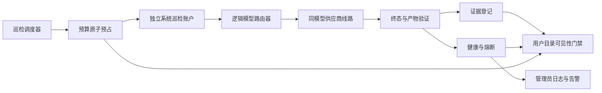

# 平台主动稳定性巡检与三板块一次性锁定设计

## 状态

- 设计日期：2026-08-18
- 设计状态：用户已逐节确认，等待书面规格复核
- 文档基线：`6bb156d9c1e727d53866587b2f918a3a893c4db1`
- 本文档只定义设计，不授权业务代码修改、供应商调用、付费生成、生产写入、推送、PR、合入或部署。

## 与既有设计的关系

本文档是
[`2026-08-15-platform-stability-one-pass-lock-design.md`](./2026-08-15-platform-stability-one-pass-lock-design.md)
的增量设计。既有设计中的逻辑模型、同模型供应商池、受控路由、任务与积分状态分离、结果未知禁止重提、可读取产物、管理员可见供应商、普通用户隐藏供应商、功能锁和受保护发布合同继续有效。

本文档只覆盖既有设计中的两项旧决策：

1. 公开供应商线路的真实巡检不再默认为人工逐次批准，而是在独立系统账户、原子预算和结果未知停止保护下自动执行。
2. 告警分级以本文档为准：全站或跨模型核心能力中断为 P0；单个逻辑模型全部线路不可用为 P1。

其他冲突按“更严格、不重复提交、不泄露供应商、不降低能力、不超过预算”的规则解释；仍无法唯一解释时停止实施并重新取得用户确认。

## 背景

平台已有图片、视频、文本等供应商适配、基础容灾、未知状态积分保护和管理员稳定性日志。但当前主要风险仍然是：供应商、Key、模型通道或返回协议在上线后发生变化，只有用户真实使用时才暴露；同时画布、短剧工厂和剧本分析尚未完成同一批次、逐入口、逐功能的完整验收和锁定。

本设计不承诺外部供应商永不故障。目标是让平台主动发现故障、限制故障影响、在有等价健康线路时自动接管，并在没有新鲜可用证据时主动隐藏模型，使用户不再充当首个探测者。

## 已确认决策

- 采用“受预算约束的真实巡检”方案。
- 自动真实巡检硬上限为每天人民币 20 元、每月人民币 600 元。
- 公开线路的真实能力证据最长有效 48 小时。
- 宁可隐藏证据过期或无法验证的模型，也不允许用户代替系统测试。
- 三个板块按“画布 → 短剧工厂 → 剧本分析”的顺序一次性验收和锁定。
- 未完成界面、后端、供应商终态、可读取产物、业务回写、下载和积分闭环的功能不得标记通过。
- 每个板块独立 PR、独立生产候选和独立增量发布；不触碰 AI 音乐项目。

## 目标

1. 每条对用户公开的主线路和备用线路都具有未过期的真实成功证据。
2. 供应商发生明确故障时，系统只切换到能力完全满足当前请求的同逻辑模型健康线路。
3. 可能已被供应商受理的请求不自动重提，用户积分保持冻结并进入对账。
4. 管理员在用户大面积反馈前看到线路、模型、熔断、切换、证据、预算和未知任务告警。
5. 画布、短剧工厂和剧本分析从真实生产入口生成完整功能清单，逐项验证、必要修复并锁定。
6. 后续修改已锁定功能时，CI 和生产激活门禁能够阻止未声明的合同变化。
7. 所有发布从最新线上版本制作候选，只增量覆盖本阶段审核文件，不覆盖其他会话成果。

## 非目标

- 不保证供应商、网络、云存储或模型永远可用。
- 不用降低分辨率、时长、参考素材数量、音频能力或输出质量来伪装容灾成功。
- 不把名称相似但能力或价格合同不同的模型自动并入同一供应商池。
- 不绕过供应商明确且合理的内容安全规则。
- 不自动修改用户提示词或参考素材。
- 不对结果未知任务自动退款、自动重试或自动切换。
- 不建设第二套重复的任务、积分、健康或管理员日志系统。
- 不在本设计阶段修改历史任务、生产数据库或线上配置。
- 不触碰、重启或发布 `/opt/moli-mama` AI 音乐项目。

## 术语与边界

### 逻辑模型

普通用户选择的稳定产品身份。用户目录只展示名称、能力范围、用户价格和可用状态，不展示供应商、域名、配置 ID、Key 或内部成本。

### 供应商线路

一个供应商配置、上游模型和目标 Key 的组合。每条线路独立记录健康、真实证据、成本和管理员状态。

### 能力指纹

决定线路是否可以接管当前请求的不可降级合同，至少包含：

- 生成类型；
- 上游模型身份或经管理员确认的逻辑模型映射；
- 分辨率、比例、时长和数量；
- 参考图片、参考视频、参考音频的数量和槽位语义；
- 首尾帧、同步音频和其他模型特性；
- 用户价格合同。

任一必要能力不匹配时，该线路不得进入当前请求的候选列表。

### 真实能力证据

使用目标线路、目标 Key 和对应能力指纹完成真实生成，取得明确成功终态，并验证结果文件可下载、可解码或可播放。模型列表、鉴权成功、HTTP 2xx、供应商返回 `success` 或历史截图都不能单独构成真实能力证据。

## 总体架构

设计复用现有统一路由、供应商健康、任务/积分、结果解析、管理员日志和功能锁模块。新增职责仅包括：巡检调度、巡检预算、证据有效期、公开目录可见性门禁，以及三个板块的完整功能清单与锁定证据。

健康熔断状态和证据生命周期是两个独立维度：线路可以网络健康但证据过期，也可以证据尚未过期但刚刚发生明确生产故障。只有两个维度都允许时，线路才能接收用户请求。

## 主动巡检

### 零成本巡检

每 5 分钟检查：

- 前后端健康、数据库、队列、对象存储和磁盘；
- 供应商 DNS、TLS、鉴权和只读接口；
- 逻辑模型、能力、价格、成本和线路映射一致性；
- 任务幂等、积分状态、对账积压和未知任务增长；
- 管理端可见供应商、普通用户不暴露供应商；
- 三个板块的无付费浏览器冒烟。

零成本巡检只能证明基础连接和内部合同，不延长真实能力证据有效期。

### 真实生成巡检触发条件

以下情况必须先完成真实生成，才能公开目标线路：

1. 新模型或新线路首次启用。
2. Key、Base URL、上游模型、协议适配、能力、价格或成本发生变化。
3. 包含该线路运行代码的版本部署完成。
4. 线路恢复自熔断、结果未知或人工停用状态。
5. 公开线路的最近真实能力证据即将超过 48 小时。

配置变化只使受影响线路失效，不连带刷新其他线路证据。

### 48 小时轮转

- 所有公开主线路和备用线路必须在连续 48 小时窗口内取得一次新鲜真实成功证据。
- 调度器按“最早过期、用户影响、线路优先级、最低可验证成本”排序。
- 同一模型存在多项风险能力时，巡检按能力指纹轮转；某项能力只有匹配证据时才可公开。
- 高成本能力不因昂贵而豁免。预算无法覆盖时，该能力或线路在证据过期后自动隐藏。
- 真实巡检不自动连续重试。一次提交结果未知即停止该线路和同供应商后续付费巡检，等待对账或人工处理。

### 巡检账户与资产隔离

- 使用独立系统租户或等价隔离身份，不使用普通用户账户。
- 不扣除、冻结或补发用户积分。
- 供应商成本进入独立巡检成本账本。
- 巡检产物进入隔离资产空间，不出现在用户素材库、项目、画布或生成历史中。
- 证据只保存必要元数据、脱敏摘要和可审计产物引用，不保存 Key、Authorization、完整签名 URL、完整 Base64 或用户提示词。

### 预算合同

- 每日硬上限：人民币 20 元。
- 每月硬上限：人民币 600 元。
- 提交前按已配置内部成本进行原子预占；并发巡检不能突破上限。
- 成功或明确失败后按实际成本结算；结果未知保留成本占用，等待对账。
- 缺少内部成本、成本为零但供应商实际收费、币种不明或无法确定最高成本时，不允许自动付费巡检。
- 预算不足不会降级为让用户测试；线路进入预算阻断并在证据过期后隐藏。
- 管理员可以人工停用巡检或线路，但不能绕过公开目录的新鲜证据门禁。

## 线路状态与自动动作

证据生命周期至少包含：

| 状态 | 含义 | 用户目录动作 |
| --- | --- | --- |
| `never_verified` | 尚无真实成功证据 | 隐藏 |
| `fresh` | 48 小时内有匹配的真实成功证据 | 结合健康状态决定是否公开 |
| `stale` | 证据已超过 48 小时 | 隐藏 |
| `failing` | 出现明确的供应商或产物失败 | 熔断该线路 |
| `submission_unknown` | 请求可能已受理或结果无法确认 | 隐藏并进入对账 |
| `budget_blocked` | 预算或成本配置不允许验证 | 隐藏 |
| `disabled` | 管理员停用 | 隐藏 |

自动恢复必须同时满足：明确解除未知任务、完成新的真实生成、产物可读取、能力指纹匹配、预算记录完整、健康熔断允许。只读接口恢复、管理员重置健康或手动点击启用不能直接恢复公开状态。

## 用户请求的自动切换

### 允许切换

只有明确证明原线路没有创建任务，或供应商提供可靠幂等保证时，才允许切换到下一条健康线路，例如：

- 发送前 DNS、TLS 或连接失败；
- 供应商明确返回未受理、无可用通道或可证明未创建任务的限流；
- 使用同一幂等键能够保证不会创建第二个任务。

切换目标必须属于同一逻辑模型、具有当前请求的完整能力指纹、证据新鲜、健康允许、管理员启用且用户价格合同一致。

### 禁止切换

以下情况立即停止自动处理：

- 已取得供应商任务号；
- 请求可能已发送，但响应前连接中断；
- HTTP 成功但结果协议无法解析；
- 供应商声称成功但产物不可读取；
- 轮询超时或最终状态未知。

普通用户任务进入 `submission_unknown`、`result_unknown` 或 `artifact_unreadable`，用户积分保持冻结，禁止重提和重复扣费。系统巡检任务不影响用户积分，但保留成本占用并停止同供应商后续付费巡检。

### 全部线路不可用

- 单线路失败：熔断并告警；仍有等价健康线路时用户无感接管。
- 同逻辑模型全部线路失败：从用户目录隐藏该模型并触发 P1。
- 多个核心逻辑模型或全站生成能力不可用：触发 P0。
- 不允许回退到未验证线路、不同模型或较弱能力线路。

## 管理员控制面与告警

管理员后台至少展示：

- 逻辑模型、供应商线路和上游模型关联；
- 能力指纹、优先级、启用状态和用户目录状态；
- 最近零成本检查、最近真实成功、证据过期时间；
- 连续失败、错误分类、熔断、半开放和恢复记录；
- 自动切换来源、目标、最终结果和是否取得供应商任务号；
- 巡检预算预占、实际成本、日/月余额和预算阻断；
- 结果未知、待对账和人工处理任务。

这些字段只能通过管理员 RBAC 接口返回。普通用户模型目录、生成响应、任务详情、错误提示和素材记录均不得出现供应商、域名、配置 ID、Key 或内部成本。

告警等级：

- **P0**：全站或跨模型核心生成能力中断、重复扣费、跨租户风险、数据库或存储不可用。
- **P1**：单逻辑模型全部线路不可用、未知任务持续增长、核心板块完整流程不可用。
- **P2**：单线路熔断、自动切换后成功、证据异常或部分能力不可用。
- **P3**：证据即将过期、预算接近上限、成本缺失或已经自动恢复的偶发问题。

复用现有管理员日志和企业微信告警通道；不另建重复通知系统。所有日志使用脱敏用户关联和安全错误摘要。

## 三个板块的一次性验收与锁定

### 固定顺序

1. 画布。
2. 短剧工厂。
3. 剧本分析。

登录、权限、积分、资产、模型路由、下载、管理端和跨板块投影作为公共能力，在每个相关板块中同时验证。前一板块锁定后，后一板块只能对其做回归，不能顺带重构。

### 生成完整功能清单

每个板块开始前，从当时真实生产入口、前端路由、可见按钮、菜单、快捷键、节点、后端接口、数据库记录和跨板块流程重新生成清单。历史文档、已有自动化、界面存在或路由注册只能作为线索，不能代替本轮清单和验证。

每项状态只允许：

- `pass`：本轮完整通过；
- `fail`：本轮稳定复现缺陷；
- `blocked`：存在明确外部或授权阻塞；
- `not_applicable`：经说明后确认不适用。

`blocked` 和 `not_applicable` 不能计入通过率。

### 验收闭环

生成能力必须完成同一批次的完整链路：

缺少任一环节时不得标记 `pass`。单元测试、Mock、构建成功、历史 PR、页面截图或供应商文档都不能替代真实闭环。

### 无缺陷与有缺陷的处理

- 无缺陷：不修改业务代码，只补充必要的自动化回归、证据和功能锁记录。
- 有缺陷：先建立稳定红灯复现，再做最小修改；验证前端、后端、刷新恢复、资产、预览/下载和积分后才能锁定。
- 与本项无关的重构、格式化、清理和交互变化不进入本阶段。
- 每项锁记录入口、验收标准、关键文件、自动化测试、浏览器证据、后端和数据库证据、生产版本；修复项额外记录缺陷和修复提交。

### 锁定后的保护

- 后续修改必须登记解锁原因、批准依据、影响范围和新增回归。
- CI 对受保护文件和合同运行对应测试；没有有效解锁记录时拒绝合入。
- 受保护生产激活器审计功能锁、候选改动范围和必需证据；不满足时拒绝切换。
- 已锁定行为只做回归，不因其他板块实施而重新设计。

## 测试与证据

### 主动稳定性测试

- 预算原子预占、日/月重置和并发上限。
- 零成本检查不能刷新真实证据。
- 48 小时证据过期后线路隐藏。
- 配置变化只使目标线路证据失效。
- 明确未受理允许切换，结果未知禁止切换。
- 能力指纹不匹配、证据过期、熔断、成本缺失和预算阻断均不能入选。
- 自动恢复必须取得新的可读取产物。
- 普通用户接口不泄露管理员线路与成本字段。
- 巡检资产和账本不污染用户数据与积分。
- 告警分级、去重、恢复和审计记录正确。

### 板块验收证据

每项按适用范围同时保留：

1. 合同测试；
2. 后端集成和数据库状态；
3. 真实浏览器逐按钮与逐交互；
4. 前端到产物、下载和积分的完整业务链；
5. 真实供应商成功终态和可读取产物；
6. 部署版本、生产健康、日志和 AI 音乐隔离回读。

证据必须属于同一候选和同一验收批次。旧证据可以帮助定位，但不能把当前未执行项判为通过。

## 分阶段实施边界

### 阶段 0：清单与基线

- 核对真实生产入口、当前公开模型、线路、能力、价格、成本和已有功能锁。
- 建立巡检与三个板块的机器可读清单。
- 不修改业务行为。

### 阶段 1：主动稳定性控制面

- 巡检调度、预算、证据生命周期和用户目录门禁。
- 管理员证据、预算、线路状态和告警展示。
- 自动切换、结果未知和恢复合同回归。

### 阶段 2：画布验收与锁定

- 按完整清单逐项验证。
- 有缺陷则精准修复，无缺陷直接锁定。
- 独立 PR、候选和增量发布。

### 阶段 3：短剧工厂验收与锁定

- 回归已锁定公共能力和画布边界。
- 完成工厂内部及跨板块流程。
- 独立 PR、候选和增量发布。

### 阶段 4：剧本分析验收与锁定

- 回归已锁定公共能力和跨板块身份。
- 完成分析、审核、回读、导入与投影闭环。
- 独立 PR、候选和增量发布。

### 阶段 5：整体验收

- 重跑全部功能锁、主动稳定性、跨板块、权限、积分和生产保护门禁。
- 不混入新功能或顺带优化。

各阶段分别编写实施计划。后一阶段只有在前一阶段证据、锁定和独立发布完成后开始。

## 发布门禁

每次候选必须：

1. 从当时实时 `/opt/moli-drama/current` 克隆，不使用本地旧工作树整体覆盖。
2. 在制作候选前核对其他会话、`deploy.lock`、当前线上版本和改动清单；重叠或冲突时停止。
3. 只覆盖本阶段已审核 allowlist 文件，不覆盖数据库、用户资产、其他会话修改或 AI 音乐文件。
4. 通过前后端全量测试、生产构建、对应浏览器回归、积分与权限、功能锁、能力/价格/成本和敏感信息审计。
5. 确认所有公开线路有新鲜真实证据，且没有未解决 P0/P1、结果未知计费风险或活动任务冲突。
6. 执行数据库备份、完整性验证、健康、磁盘、日志、队列和 AI 音乐 PID 隔离检查。
7. 只通过共享 `activate-protected-release.sh CANDIDATE EXPECTED_CURRENT` 执行 CAS 切换，禁止直接替换 `current` 或绕过共享门禁。

部署后执行健康、日志、关键入口、模型目录、管理员日志和无付费冒烟。关键项失败立即通过受保护流程回滚到部署前版本，保留候选和失败证据，不在故障线上继续叠加覆盖。

## 完成标准

只有同时满足以下条件，整个稳定性阶段才能标记完成：

- 画布、短剧工厂和剧本分析的功能清单覆盖率为 100%。
- 所有适用项为 `pass`；`blocked` 和 `not_applicable` 均有明确说明且不伪装成通过。
- 所有对用户公开的模型和能力均有 48 小时内的匹配真实成功证据。
- 没有未解决 P0/P1、未知提交、未知结果、不可读取产物或积分对账风险。
- 自动巡检、预算、熔断、等价切换、隐藏、恢复和管理员告警正在运行并有证据。
- 每项能力都有可复跑测试、同批次证据和功能锁记录。
- 生产 release、健康、日志、备份、回滚点和 AI 音乐隔离均已回读。

任何一项不满足时，只能报告实际 `fail` 或 `blocked`，不能宣称“全部正常”“没有 BUG”或“验收完成”。

## 风险与控制

- **供应商仍可能突然故障**：通过五分钟零成本检查、48 小时真实巡检、生产信号熔断和等价线路接管缩小暴露窗口。
- **真实巡检产生费用**：通过独立账本、原子预占和日/月硬上限控制；预算不足时隐藏，不突破上限。
- **巡检自身重复提交**：结果未知立即停止同供应商付费巡检，保留成本占用并对账。
- **自动切换降低结果质量**：能力指纹是硬门禁，不允许不同模型或较弱能力接管。
- **验收范围过大**：拆成五个独立实施阶段，每阶段独立计划、PR、候选和锁定。
- **多会话发布污染**：候选从最新线上制作，使用 allowlist、部署锁、CAS 和共享受保护激活器。
- **敏感信息泄漏**：供应商与成本只在管理员 RBAC 接口和脱敏日志出现。

## 设计结论

平台稳定性不以“供应商永不失败”为前提，而以“主动发现、证据驱动公开、等价线路接管、未知状态停止、用户积分保护和一次性功能锁定”为合同。严格模式下，没有新鲜真实证据的能力不会继续面向用户开放。

本文档已完成设计确认，但尚未授权实施。用户复核书面规格后，下一步只允许使用 `writing-plans` 为各阶段编写详细实施计划。
